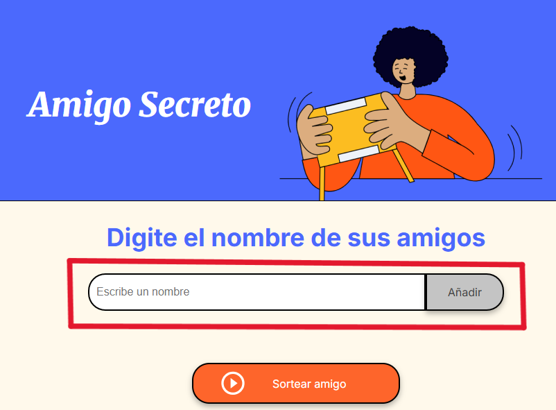
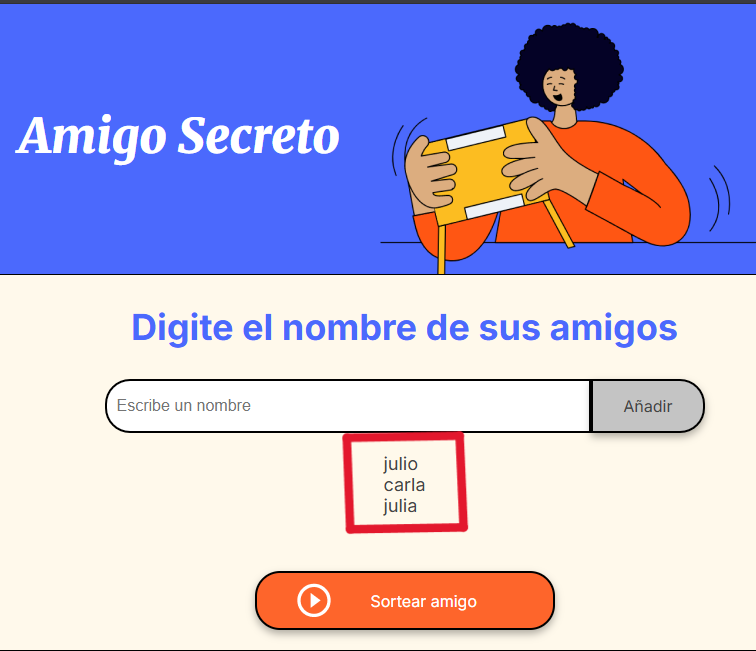
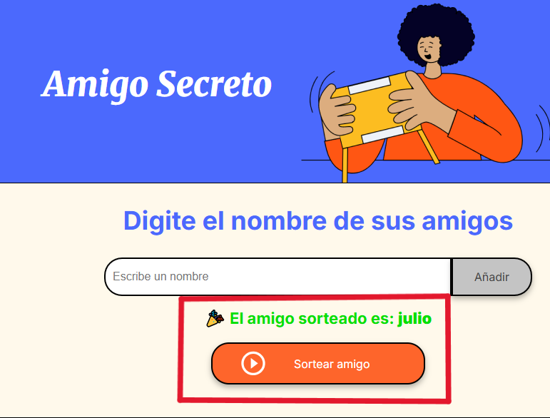

# 🎁 Amigo Secreto


Una pequeña aplicación web interactiva que permite agregar nombres de amigos y realizar un sorteo aleatorio para seleccionar un "amigo secreto". Ideal para juegos en reuniones, fin de año, o eventos de grupo.

---

## ✨ Funcionalidades

✅ Agregar nombres de participantes  
✅ Mostrar dinámicamente la lista de amigos agregados  
✅ Eliminar duplicados al actualizar la lista  
✅ Realizar un sorteo aleatorio usando `Math.random()`  
✅ Ocultar la lista de participantes al momento del sorteo  
✅ Interfaz limpia y responsiva con estilos personalizados  

## 🖼️ Capturas de pantalla

### 📋 Agregar participantes



---

### 🔄 Lista de nombres



---

### 🎉 Resultado del sorteo



---

## 🎮 Cómo usarlo

1. **Clonar el repositorio:**

```bash
git clone https://github.com/solanomillo/Challenge-Amigo-Secreto.git
cd Challenge-Amigo-Secreto  
```

2. Abrir el archivo index.html en tu navegador:
- Abrir index.html o simplemente doble clic en el archivo desde tu explorador de archivos

3. Interactuar:

- Escribe un nombre en el campo de entrada.

- Presiona “Añadir”.

- Cuando termines de cargar nombres, hacé clic en “Sortear amigo”.

- Verás quién fue elegido como "amigo secreto" 🎁

# 🔧 Tecnologías usadas
- HTML5

- CSS

- JavaScript

- Git para control de versiones

# 📂 Estructura del proyecto
```text
Challenge-Amigo-Secreto/
  ├── index.html
  ├── style.css
  ├── app.js
  ├── assets/
  │   └── amigo-secreto.png
  │   └── play_circle_outline.png
  ├── screenshots/
  │   └── input.png
  │   └── lista.png
  │   └── sorteo.png
```
# 🚀 Mejora futura (ideas)
- Permitir eliminar nombres de la lista

- Validar que no haya nombres duplicados

- Agregar opción para repetir el sorteo

- Guardar los nombres en localStorage

- Exportar el resultado como imagen o PDF

# 👨‍💻 Autor
**Julio Solano**  
🔗 [GitHub](https://github.com/solanomillo)  
📧 solanomillo144@gmail.com
